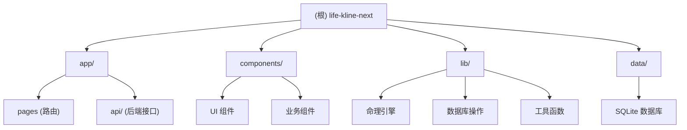

# life-kline-next - 人生K线图 AI 命理分析平台

> 最后更新：2026-02-24 22:18:52
> 项目状态：✅ 核心功能完成，生产环境运行中

---

## 变更记录 (Changelog)

### 2026-02-24
- ✅ 初始化 AI 上下文文档系统
- ✅ 完成项目架构扫描与模块识别
- ✅ 生成根级与模块级文档结构

---

## 项目愿景

life-kline-next 是一个基于 Next.js 15 构建的现代化命理分析平台，致力于将传统八字命理学与现代 AI 技术深度融合。通过精准的天文历法计算（真太阳时修正）、权威的命理分析引擎、以及 AI 大语言模型的深度解读，为用户提供专业、可信、个性化的人生决策辅助工具。

核心目标：
- **精准性**：毫秒级四柱排盘，真太阳时修正，分钟级节气判定
- **专业性**：基于滴天髓、三命通会等传统命理理论，600+ 条大师话术库
- **智能化**：AI 驱动的个性化解读，持续对话系统，长期用户档案管理
- **可信度**：数据支撑、古籍引用、名人案例对比，建立用户信任

---

## 技术栈概览

### 核心框架
- **Next.js 15.0.0** - React 服务端渲染框架（App Router）
- **React 19.0.0** - UI 组件库
- **TypeScript 5** - 类型安全开发

### 数据层
- **better-sqlite3** - 本地 SQLite 数据库（WAL 模式）
- **lunar-javascript** - 农历与八字排盘核心库

### AI 集成
- **OpenAI SDK** - LLM 深度解析（支持自定义 API 端点）

### UI 与样式
- **Tailwind CSS 3.4** - 原子化 CSS 框架
- **Recharts 3.7** - 数据可视化图表
- **Lucide React** - 图标库

### 部署与运维
- **PM2** - Node.js 进程管理
- **Nginx** - 反向代理与静态资源服务

---

## 架构总览

### 模块结构图



### 系统架构层次

```
┌─────────────────────────────────────────────────────────┐
│                    用户界面层 (UI)                        │
│  Next.js Pages + React Components + Tailwind CSS        │
└─────────────────────────────────────────────────────────┘
                            ↓
┌─────────────────────────────────────────────────────────┐
│                   业务逻辑层 (BLL)                        │
│  API Routes + Fortune Engine + LLM Integration          │
└─────────────────────────────────────────────────────────┘
                            ↓
┌─────────────────────────────────────────────────────────┐
│                   数据访问层 (DAL)                        │
│  Database Operations + SQLite (better-sqlite3)          │
└─────────────────────────────────────────────────────────┘
                            ↓
┌─────────────────────────────────────────────────────────┐
│                   核心引擎层 (Core)                       │
│  Bazi Analyzer + Solar Time + Lunar Calendar            │
└─────────────────────────────────────────────────────────┘
```

---

## 模块索引

| 模块路径 | 职责描述 | 关键文件 | 文档链接 |
|---------|---------|---------|---------|
| `app/` | Next.js 路由与页面 | page.tsx, layout.tsx | [查看详情](./app/CLAUDE.md) |
| `app/api/` | RESTful API 接口 | analyze/route.ts, chat/route.ts | [查看详情](./app/api/CLAUDE.md) |
| `components/` | React UI 组件 | fortune-form.tsx, ai-assistant-chat.tsx | [查看详情](./components/CLAUDE.md) |
| `lib/` | 核心业务逻辑库 | fortune-engine.ts, database.ts, llm.ts | [查看详情](./lib/CLAUDE.md) |
| `data/` | SQLite 数据库文件 | lifekline.db | - |

---

## 运行与开发

### 环境要求
- Node.js >= 18.0.0
- npm >= 9.0.0
- SQLite3 支持

### 本地开发

```bash
# 安装依赖
npm install

# 启动开发服务器
npm run dev

# 访问 http://localhost:3000
```

### 生产构建

```bash
# 构建生产版本
npm run build

# 启动生产服务器
npm start

# 或使用 PM2 管理
pm2 start ecosystem.config.js
```

### 环境变量

创建 `.env.local` 文件：

```bash
# OpenAI API 配置（可选，用于 LLM 深度解析）
OPENAI_API_KEY=your_api_key_here
API_BASE_URL=https://api.openai.com/v1
DEFAULT_MODEL=gpt-4

# 数据库路径（默认：./data/lifekline.db）
DATABASE_PATH=./data/lifekline.db
```

---

## 测试策略

### 当前测试覆盖
- ⚠️ 单元测试：未实现
- ⚠️ 集成测试：未实现
- ✅ 手动测试：核心流程已验证

### 测试建议
1. **命理引擎测试**：验证四柱排盘、五行分析、用神判断的准确性
2. **真太阳时测试**：验证不同经纬度的时间修正计算
3. **API 接口测试**：验证 /api/analyze、/api/chat 等接口的响应
4. **数据库操作测试**：验证 CRUD 操作的正确性

### 测试文件位置（建议）
```
tests/
├── unit/
│   ├── fortune-engine.test.ts
│   ├── bazi-analyzer.test.ts
│   └── solar-time.test.ts
├── integration/
│   ├── api-analyze.test.ts
│   └── database.test.ts
└── e2e/
    └── user-flow.test.ts
```

---

## 编码规范

### TypeScript 规范
- 严格模式启用（`strict: true`）
- 优先使用接口（interface）定义类型
- 避免使用 `any`，使用 `unknown` 或具体类型
- 导出类型定义到 `lib/user-types.ts`

### React 组件规范
- 优先使用函数组件 + Hooks
- 客户端组件标记 `'use client'`
- 服务端组件默认（无需标记）
- Props 类型定义使用 interface

### 文件命名规范
- 组件文件：kebab-case（如 `fortune-form.tsx`）
- 工具函数：kebab-case（如 `solar-time.ts`）
- 类型定义：kebab-case（如 `user-types.ts`）
- API 路由：`route.ts`（Next.js 约定）

### 代码组织
- 一个文件一个主要导出
- 相关工具函数放在同一文件
- 复杂逻辑拆分为独立模块
- 避免循环依赖

---

## AI 使用指引

### 与 AI 协作的最佳实践

1. **理解项目上下文**
   - 阅读本文档了解项目架构
   - 查看模块级 CLAUDE.md 了解具体实现
   - 参考 PROJECT-SUMMARY.md 了解业务逻辑

2. **修改代码前**
   - 先阅读相关模块文档
   - 理解现有实现逻辑
   - 确认修改不会破坏现有功能

3. **添加新功能**
   - 遵循现有架构模式
   - 更新相关文档
   - 添加必要的类型定义

4. **调试问题**
   - 检查浏览器控制台错误
   - 查看服务端日志（`pm2 logs`）
   - 验证数据库状态（SQLite 查询）

### 常见任务指引

#### 添加新的 API 接口
1. 在 `app/api/` 下创建新目录
2. 创建 `route.ts` 文件
3. 实现 GET/POST/PUT/DELETE 方法
4. 更新 `app/api/CLAUDE.md` 文档

#### 添加新的页面
1. 在 `app/` 下创建新目录
2. 创建 `page.tsx` 文件
3. 实现页面组件
4. 更新 `app/CLAUDE.md` 文档

#### 修改命理分析逻辑
1. 编辑 `lib/fortune-engine.ts`
2. 更新相关类型定义 `lib/user-types.ts`
3. 测试分析结果准确性
4. 更新 `lib/CLAUDE.md` 文档

---

## 全局规范

### 数据库规范
- 使用 SQLite WAL 模式提高并发性能
- JSON 字段存储复杂对象（bazi, fiveElements 等）
- 外键约束确保数据完整性
- 索引优化查询性能

### API 规范
- RESTful 风格接口设计
- 统一响应格式：`{ success: boolean, data?: any, error?: string }`
- 错误处理：返回适当的 HTTP 状态码
- 请求验证：检查必要参数

### 安全规范
- 不在客户端暴露敏感信息
- API Key 存储在环境变量
- 用户输入验证与清理
- SQL 注入防护（使用参数化查询）

### 性能规范
- 图片优化：使用 Next.js Image 组件
- 代码分割：动态导入大型组件
- 缓存策略：静态资源 CDN 缓存
- 数据库查询优化：使用索引

---

## 相关文档

- [项目总结](./PROJECT-SUMMARY.md) - 完整的项目开发总结
- [重构计划](./REFACTORING-PLAN.md) - 代码重构方案
- [部署指南](./DEPLOY-GUIDE.md) - 生产环境部署步骤
- [AI 助手系统](./AI-ASSISTANT-SYSTEM.md) - AI 对话系统设计
- [大师话术指南](./MASTER-LANGUAGE-GUIDE.md) - 命理话术库说明

---

## 快速链接

- 🏠 [首页](/) - 用户入口
- 📊 [命理排盘](/analyze) - 八字分析
- 💬 [AI 咨询](/chat) - 智能对话
- 📅 [日历择吉](/events) - 事件管理
- 👤 [用户档案](/profile) - 个人中心

---

**注意**：本文档由 AI 自动生成并维护。如有疑问或需要更新，请联系项目维护者。
